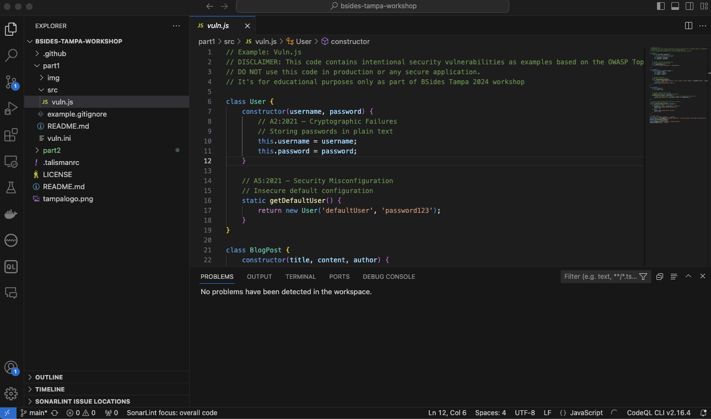
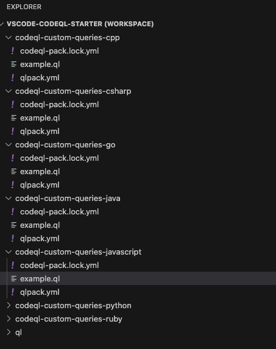
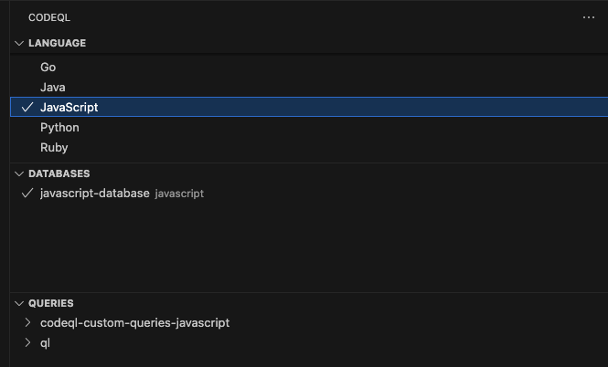
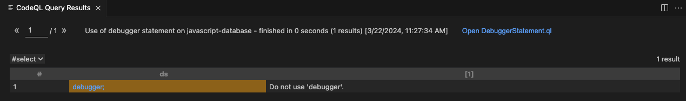

# Part 1 - Security within the development environment

In Part 1 we look at a variety of technologies that can be used to improve security in the SDLC at the development environment level.

A number of technologies are used during this part of the workshop including:

1. SonarLint: https://docs.sonarsource.com/sonarcloud/improving/sonarlint/ 

2. VSCode: https://code.visualstudio.com/

3. SonarCloud: https://sonarcloud.io/

4. GitHub: https://github.com/ and GitHub CodeQL: https://codeql.github.com/docs/codeql-overview/ 

5. AWS Labs git-secret: https://github.com/awslabs/git-secrets

6. Talisman: https://github.com/thoughtworks/talisman

7. .gitignore files: https://git-scm.com/docs/gitignore

8. BFG repo-cleaner: https://rtyley.github.io/bfg-repo-cleaner/ 

For this workshop there are two approaches you can take. The first is to use a GitHub Codespace. This is the recommended approach on the day for the workshop as it avoids any installation/setup issues.The second approach is to configure the tooling locally on youy laptop. This may be better suited for after the workhop, when you revisit the material. 

We have provided setup scripts for using the Codespace during the workshop. This avoids the issues with having to install packages locally on your laptop and battle configuration settings. You can also use VS Code with CodeSpaces, more info on this can be found here:

https://docs.github.com/en/codespaces/developing-in-a-codespace/using-github-codespaces-in-visual-studio-code

Examples in this workshop use commandline prompts that should work on Linux, MacOS and Windows Subsystem for Linux (WSL) as well as winthin CodeSpaces

The first account you will need if you have not created it already is a GitHub one. You can create an account here: https://github.com 

Once this created, you can now fork this repository.

Follow the instructions below, to fork https://github.com/tweag/hope-sec-dev-workshop-2024

The following instructions are broken out into Codespaces and local setup. As noted, for the workshop on the day at HOPE we recommend following the Codespaces approach. 

## Codespaces Setup

Navigate to the Code tab in your repository. 

Next, select the green Code button which will dispaly a drop down.

Select the Codespaces tab.

Select the `Create codesapce on main` button.

## Local Machine Setup

https://docs.github.com/en/pull-requests/collaborating-with-pull-requests/working-with-forks/fork-a-repo

If you do not have Git installed locally, also ensure you set this up:

https://git-scm.com/book/en/v2/Getting-Started-Installing-Git

Once both of these tasks are complete, you can clone the repository:

`git clone <repo name>`

With the code now located on your local machine, you are ready to start.


## Module 1: IDE Integration 

The first part of the workshop will cover security within the Integrated Development Environment (IDE).

In this example we will add plugins to the IDE in order to detect security issues on the fly.

### SonarLint Plugin  

We will be using a plugin called SonarLint. SonarLint can be obtained from:

https://docs.sonarsource.com/sonarcloud/improving/sonarlint/

Supported IDEs include:

1. JetBrains IDEs (IDEA, CLion, GoLand, WebStorm etc.)

2. Visual Studio 

3. VS Code and VS Code in Codespaces

4. Eclipse 

During this workshop we use VS Code in Codespace for examples, but this can be replaced with the supported IDE 
of your choice. 

SonarLint has a number of features including:

* Connects with SonarCloud 
* Rules and issues
* Quick Fixes
* Secrets Detection 
* Vulnerability detection 

Download and install the plugin into your IDE before proceeding. 

For this demo we also recommend creating a SonarCloud account. You can do this via your GitHub user at:

https://sonarcloud.io/

SonarLint will still work without a SonarCloud account, but has fewer features. 

Once you have an account, make a note of your `Organization` name from the `Organizations` tab in SonarCloud.

Next generate a token. Go to the `Security` tab and generate a new token, call it `dev-sec-ops-demo`.

In your IDE, select the `Add SonarCloud Connection` option. On this screen you can add the token, and `Organization Key`.

Using SonarLint we can now detect security issues in the code base.

Open up the `vuln.ini` in the `part1` folder in your IDE. 



You should see that under the `aws_key_id` key id value is a wavy line. If you hover over this, or select the `PROBLEMS` tab, an error should be present:

```console

Make sure the access granted with this AWS access key ID is restricted

``` 

This indicates that SonarLint has picked up on the key being hardcoded into the file.

Let's now look at some of the other findings in the JS file:

* Use of `var` instead of `let` or `const`
* Useless variable assignments (note also the use of the local DB)
* Inclusion of an `alert` which could leak sensitive information
* Use of the `debugger` statement, which SonarLint flags for security concerns 

If you select the example `var sqlresult` where `var` being used a small lightbulb will appear, clicking this will allow you to quickly fix the issue.

Try this and you will see it replaced the `var` with `let` and removes the detected issue. We're going to leave the other issues in place now, so we can demonstrate how to fix them using some of the other tools in this workshop. 

That wraps up using SonarLint. You can use it to quickly detect parts of your codebase that may have syntax errors, styling problems, and a subset of security issues.

Let's take a look at an alernative tool to SonarLint which can also detect issues in the codebase. 

### CodeQL

We're now going to switch over to using another tool that can aid in detecting security issues in our source code. This tool is called CodeQL.

The first step is to install the CLI tools prior to adding in the VS Code plugin.

Instructions for Codespace and local installation are now presented.


#### Codespaces

Run the ./codeqlinstall script 


#### Local Installation 

GitHub provides instructions here:

https://docs.github.com/en/code-security/codeql-cli/getting-started-with-the-codeql-cli/setting-up-the-codeql-cli

And we will provide a quick overview here on what you need to do, to get the CLI installed and setup.

1. Head over to the CodeQL Bundle release page: https://github.com/github/codeql-action/releases

2. Download the latest version of the bundle for your OS. These bundles are listed under `Assets`

3. Unzip the bundle.

4. Once the zip is extracted the CodeQL CLI will be available for use. You may want to add this to your `PATH` so you can execute the CLI with a simple `codeql` command. You can read more about adding CodeQL to your `PATH` here: https://docs.github.com/en/code-security/codeql-cli/getting-started-with-the-codeql-cli/setting-up-the-codeql-cli#2-extract-the-zip-archive  

5. Test the codeql command, you should see something similar to:

```console

Create and query CodeQL databases, or work with the QL language.

GitHub makes this program freely available for the analysis of open-source software and certain other uses, but it is not itself free software. Type codeql --license to see the license
terms.

      --license              Show the license terms for the CodeQL toolchain.
Common options:
  -h, --help                 Show this help text.
  -v, --verbose              Incrementally increase the number of progress messages printed.
  -q, --quiet                Incrementally decrease the number of progress messages printed.
Some advanced options have been hidden; try --help -v for a fuller view.
Commands:
  query       Compile and execute QL code.
  bqrs        Get information from .bqrs files.
  database    Create, analyze and process CodeQL databases.
  dataset     [Plumbing] Work with raw QL datasets.
  test        Execute QL unit tests.
  resolve     [Deep plumbing] Helper commands to resolve disk locations etc.
  execute     [Deep plumbing] Low-level commands that need special JVM options.
  version     Show the version of the CodeQL toolchain.
  generate    Commands that generate useful output.
  github      Commands useful for interacting with the GitHub API through CodeQL.
  pack        Commands to manage QL packages.
  diagnostic  [Experimental] Create, process, and export diagnostic information.
```

6. We can now test that codeql is correctly setup to generate a database. Use the following command:

```console

codeql resolve qlpacks
```

You should now see it output something similar to this example:

```console

codeql-csharp-consistency-queries (/workshop/qlpacks/codeql/csharp/ql/consistency-queries)
codeql-csharp-tests (/workshop/qlpacks/codeql/csharp/ql/test)
codeql-go-consistency-queries (/workshop/qlpacks/codeql/go/ql/consistency-queries)
codeql-java-consistency-queries (/workshop/qlpacks/codeql/java/ql/consistency-queries)
codeql-swift-tests (/workshop/qlpacks/codeql/swift/ql/test)

```

Now we have the commandline tool in place we are going to generate a database off of our vulnerable code. This database is an Abstract Syntax Tree representation of the code combined with some metadata about the code base. GitHub provides and overview on the database and using it in VS Code here: https://codeql.github.com/docs/codeql-for-visual-studio-code/exploring-the-structure-of-your-source-code/


```console

./codeql database create --language=javascript-typescript --source-root ../dev-sec-ops-workshop/part1 ../javascript-database

```

This will output:

```console

Initializing database at /workshop/javascript-database.
Running build command: []
[2024-03-22 09:20:15] [build-stdout] Single-threaded extraction.
[2024-03-22 09:20:15] [build-stdout] Extracting /workshop/dev-sec-ops-workshop/part1/src/vuln.js
[2024-03-22 09:20:15] [build-stdout] Done extracting /workshop/dev-sec-ops-workshop/part1/src/vuln.js (327 ms)
[2024-03-22 09:20:15] [build-stderr] No externs trap cache found

...

Finalizing database at /workshop/javascript-database.
Running TRAP import for CodeQL database at /workshop/javascript-database...
Importing TRAP files
Merging relations
Finished writing database (relations: 13.32 MiB; string pool: 4.78 MiB).
TRAP import complete (4s).
Finished zipping source archive (247.38 KiB).
Successfully created database at /workshop/javascript-database.

```

#### Plugin Installation 

We now have a database generated from our code to work with. However before we can use it via the VS Code IDE we will need to install the plugin.

You can find basic installation instructions for VS Code here:

https://codeql.github.com/docs/codeql-for-visual-studio-code/setting-up-codeql-in-visual-studio-code/

Once you have the plugin installed, we can setup a CodeQL workspace.

#### Codespace Workspace setup 

First however we need to create a zip file with the database we created previously.

Navigate to the CodeSpace you created for the workshop if you don't still have it open. From the commandline run the `codeqldb.sh` file to create a zip and move it into your repository.

Next, we can fork the 1vscode-codeql-starter1 repository and run CodeQL as a Codespace from here.

Navigate to https://github.com/github/vscode-codeql-starter

Fork a copy of this repository. Then once forked, create a CodeSpace from the `main` branch. 

Inside of the VS Code IDE in the left hand menu open the `Extensions` panel.

In the `Search Extensions in Marketplace` field, enter `CodeQL`

Click `Install` next to the `CodeQL` option.

#### Locall Installation Workspace setup 

In this workshop we will use the `Starter Workspace`. 

We're going to need to get the CodeQL libraries and queries and can clone this from GitHub into a new directory on your machine:

```console

git clone --recursive git@github.com:github/vscode-codeql-starter.git

```

Once this has cloned we need to switch back to VS Code. 


#### Working with queries

Once in the IDE select `File > Open Workspace from File`

Navigate to the folder where you checked out the `vscode-codeql-starter` repository and select the `vscode-codeql-starter.code-workspace` file. 

This will now load the workspace in visual studio. Save any changes if prompted to the `vuln.js` file you edited.

In the left-hand menu you should now see a list of queries.



Scroll down and select the `example.ql` from under the `codeql-custom-queries-javascript` to see an example of a CodeQL query.

This demonstrates the format that CodeQL queries are written in. If you scroll down further to the `ql` folder and expand it you'll see a section called `javascript`.

Under this folder you will find the configuration of JavaScript queries for detecting issues with the code base.

In order to test the queries against our codebase we can now load our database via the `DATABASES` panel in VS Code.

Select the `Choose Database from Folder` option, and select the database we created from the source code.



You can filter the queries in the `QUERIES` panel to only display JavaScript ones, by selecting `JavaScript` from the `LANGUAGE` panel. This should make the query list easier to navigate.

From the `QUERIES` list navigate down to find `javascript / ql > src > LanguageFeatures > DebuggerStatement.ql`. A triangle will appear. This is the run icon, which will execute the query against the database. Click this.

CodeQL will now run the query against our source code. It might take a few seconds to compile, optomize and execute. You should now see it finds the `debugger` statement in the source code.



CodeQL has a huge number of queries available for JavaScript. You can scroll through the list and try running some of them to see what you can find. 

That wraps up the basics of using CodeQL to build a database of our code, and manually run scans against it to find issues. When we move on to Part 2 you will see CodeQL in action within GitHub Advanced Security, where it provides SAST support. 

### GitHub Copilot (optional hands on)

For those of you with student accounts or paid GitHub accounts you can integrate Copilot into your IDE and use the power of GenerativeAI to detect and remediate issues.  

Copilot is GitHub's new tool to integrate GenAI into the development process allowing you to generate code and unit tests on the fly. It can also be used to help detect security vulnerablities in source code.

To register for a plan refer to:

https://github.com/features/copilot/plans

A quick start guide is provided here: https://docs.github.com/en/copilot/quickstart

For this course, we are interested in installing the Copilot extension in VS Code.

1. Install the plugin from the marketplace: https://marketplace.visualstudio.com/items?itemName=GitHub.copilot

2. If prompted, open VS Code

3. Under the `Extension: GitHub Copilot` tab, select `Install`

4. You will now be prompted to grant permissions to authorize Copilot.

With Copilot installed you can follow along with the steps below.

1. Open the Chat Window

2. Enter the following prompt "Can you highlight security issues in my code?"
 
3. Co-pilot will execute your query and spit out a response similar to the following:

```console 

SQL Injection: In the saveToDatabase method, you're directly inserting the blogPost properties into the SQL query. This makes your application vulnerable to SQL injection attacks.

```
```javascript
static saveToDatabase(blogPost) {
        const sql = `INSERT INTO blog_posts (title, content, author) VALUES ('${blogPost.title}', '${blogPost.content}', '${blogPost.author}')`;
    }
```

4. We can now ask it how to remediate this issue by asking "How can I prevent SQL injection in my code?"

Co-pilot will now spit out an example of how the code can be refactored.


```console
To prevent SQL injection, you should use parameterized queries or prepared statements. This ensures that user input is always treated as literal data and not part of the SQL command. Here's how you can modify your saveToDatabase method to use parameterized queries:
```

```javascript
    static saveToDatabase(blogPost) {
        const sql = `INSERT INTO blog_posts (title, content, author) VALUES (?, ?, ?)`;
        // Pretend database call
        console.log(`Executing SQL: ${sql}`);
        var db = window.openDatabase("sqlcachedb", "1.0", "Cache result", 200000);
        db.transaction(function(tx){
            tx.executeSql(sql, [blogPost.title, blogPost.content, blogPost.author], function(tx, results){
                console.log("Data inserted successfully");
            }, function(tx, error){
                console.log("Error occurred while inserting data");
            });
        });
    }
```

```console
In this code, the ? are placeholders for the actual values. The values are passed in as an array in the second argument to executeSql. This ensures that the values are properly escaped, preventing SQL injection attacks.
```

Much like we did with SonarLint, we can fix issues by selecting the wavy lines and clicking the small icon that pops up. Select the line with the `var db = window.openDatabase` issue.

From the menu, select the `Fix using Copilot. 

You'll now be presented with an option to replace `var` with `let` like we did in the previous example. Select this and save your change.

Using these mechanism we can have Copilot present us with a set of fixes for the issues it detected, as well as the problems that SonarLint and CodeQL highlighted.

So in addition to detecting and fixing issues from the IDE, what else can we do to harden our development process?

## Module 2: Pre-commit Hooks 

Having demonstrated how we can fix security issues as we go, we next look at mechanisms to prevent code with vulnerabilities, such as hard coded secrets being commited 
to the repository. To do this we will show you how to use pre-commit hooks.

### AWS Labs git-secrets 

In the `.ini` file you will remember we have provided an example of a hard coded (dummy) AWS API key. 

The AWS git-secrets tool can be used to scan files locally for hardcoded keys in order to alert the engineer.

You can clone the repository from the following location:

https://github.com/awslabs/git-secrets

The `README` explains a number of mechanisms to install git-secrets based upon your OS.

For each repository you will need to install the hooks. Once git-secrets is installed, in this repository install the hooks via:

```console

git secrets -- install

```

Next let's register common AWS patterns for scanning:

```console

 git secrets --register-aws

```

It is also possible to add specific strings that represent common patterns e.g. keys in a repo:

```console 

git secrets --add '[A-Z0-9]{20}'

```

We can run a scan as follows:

```console 

git secrets --scan

```

You should now see output similar to the following:

```console
[ERROR] Matched one or more prohibited patterns

Possible mitigations:
- Mark false positives as allowed using: git config --add secrets.allowed ...
- Mark false positives as allowed by adding regular expressions to .gitallowed at repository's root directory
- List your configured patterns: git config --get-all secrets.patterns
- List your configured allowed patterns: git config --get-all secrets.allowed
- List your configured allowed patterns in .gitallowed at repository's root directory
- Use --no-verify if this is a one-time false positive
```

Edit this README file, and make a change here, change status: `incomplete` to `complete`.

`status: incomplete`


Commit this change to the text file. You should now see the pre-commit hook kick in.
It will warn you that a secret is present in the repository.

We are now going to look at a tool that can do this on a much broader scale.


### Talisman 

We've seen how AWS simple but effective tool can be used to create pre-commit hooks and catch 
API keys being commited to the repository.

The next tool we will look at is Talisman. You can find it at the following GitHub repository:

https://github.com/thoughtworks/talisman

Talisman is capable of scanning git changesets to ensure secrets and other sensitive information is
not added to the repository. This includes not only AWS API Keys, but SSH keys, tokens, passwords and similar.
 
Open up the `README` file in the GitHub repository and follow the installation steps for your OS.

Once installed we can configure a stand alone pre-commit hook for our repository.

Run the following command:

```console
echo "talisman -g pre-commit" >> .git/hooks/pre-commit
```

Much like with the AWS tool, the pre-commit hook will now act as a blocker to commiting secrets to the code base.

We can ignore false positives using the `.talismanrc` file. You can see an example in the root of this project. 

Here we have told it to ignore the `README` file, since it contains words that trigger a false positive.

```console
Talisman Scan: 3 / 3 <-----------------------------------------------------------------------------------------------------------------------------------------------------------> 100.00%  

Talisman Report:
+-----------------+--------------------------------+----------+
|      FILE       |             ERRORS             | SEVERITY |
+-----------------+--------------------------------+----------+
| part1/README.md | Potential secret pattern :     | low      |
|                 | not added to the repository.   |          |
|                 | This includes not only AWS API |          |
|                 | Keys, but SSH keys, tokens,    |          |
|                 | passwords and similar.         |          |
+-----------------+--------------------------------+----------+


If you are absolutely sure that you want to ignore the above files from talisman detectors, consider pasting the following format in .talismanrc file in the project root

fileignoreconfig:
- filename: part1/README.md
  checksum: 7bc8a740923be465f9f54f83fef533d0e93fa2b978350fc006d2094f2d47741d
version: ""

```

We can also ignore low severity findings, by adding the following line to our .talismanrc

```YAML

threshold: medium

```

Of course, this introduces the risk that true positives could be added to the code base. 

Talisman can also be run as a command line tool. This will scan the target directory for secrets and output a JSON file with a list of findings.

To run a scan you can type:

```console

talisman -s

``` 

The output will be added to:

```console

talisman_report/talisman_reports/data

```


Give this a try and navigate to the folder. Open the JSON file in your IDE to examine it. 


## Module 3: Preventing accidental commits


We've seen a couple of methods to catch secrets from being commited to the repository. We can also prevent whole files being added. 

Much as we saw with the `.talismanrc` file where we could configure talisman to ignore false positives, we can use a `.` file to prevent whole file types being commited to git.

To do this, we use the `.gitignore` file. Our next task will be to demonstrate how they work.

### .gitignore files 

Within the repository we have provided an example ignore file called `example.gitignore`.

Rename the `example.gitignore` file in the root of this directory to `.gitignore`.

Now try copying the `vuln.ini` file as a `.env` file.

```console
cp vuln.ini .env
```

Now run:

```console
git status
```

You should see the `.env` file isn't present e.g. 

```console
Untracked files:
  (use "git add <file>..." to include in what will be committed)
	.gitignore
```

This is because the `.gitignore` file is preventing this file type from being added. 


If you edit the `.gitignore` file to remove the `.env` line, then run `git status` again, it will be listed e.g.


```console
Untracked files:
  (use "git add <file>..." to include in what will be committed)
	.env
	.gitignore
```

As you can see this simple technique can be used to block production configuration files with secrets located in them from being commited and pushed to GitHub, thus exposing them.

We can also use this technique to prevent binary files, PDFs or other file types that are undesirable being commited to the repository.

So what happens if we have already commited a file, or somebody not following best practices adds one? Well there are techniques we can use to clean it up.

Let's look at an example.


### BFG to clean up accidental commits

In some cases a file may already exist in the commit history that we need to remove. This could have been due to a disabled pre-commit hook, a file or pattern that wasn't caught, or a file added prior to the introduction of DevSecOps processes.

In order to clean up historical commits we can use BFG. Let's try an experiment to demonstrate this. 

If you haven't downloaded/installed BFG yet, you can find it here:

https://rtyley.github.io/bfg-repo-cleaner/

The `bfg` command used later in this example is an alias for calling the BFG .jar file:

```console

java -jar bfg.jar

```

You can add an alias to your `.bash_profile` or `.zshrc` file:

```console

alias bfg='java -jar bfg.jar'
```

Or if you want, replace the `bfg` references below with the direct call to the `.jar` file shown above. 

With BFG setup, we can now try and experiment.

We previously modified our `.gitignore` file so that we can now commit the `.env` file which contains secrets. 

We are now going to demonstrate how a mistake can happen that needs to be cleaned up. Add and commit this modified `.gitignore` file now:

```console
git commit -m"Adding the .env file so we can demonstrate BFG"
```


Now push this commit to your fork.

```console
git push
```

We should now see the `.env` file is present, along with all the leaked secrets!

When a mistake like this happens in real life there are two steps we would want to take:

1. Remove the secrets from the repository

2. Rotate them so they are now obsolete

Let's now use BFG to scrub the file from the repository:

```console
bfg --delete-files .env my-forked-repo.git
```

BFG will now remove the `.env` file we added.

We can check this was successful by checking the log:

```console
git log

git show HEAD
```

Once you are happy the file is cleared, go ahead and push the changes back to your fork:

```console
git push
```

So we just saw a simple approach to doing file clean up!


## Conclusion

You've now completed Part 1. Here we setup our development environment and accounts and we learned about:

1. IDE plugins to detect secutity issues

2. Pre-commit hooks to prevent adding passwords and API keys to GitHub

3. Using .gitignore files to bock whole file types being commited

4. A technique to clean up accidentally commited files

In Part2 we are now going to see how the next line of defense in the source control management system and CI/CD pipelines can perform similar and complementing tasks.

